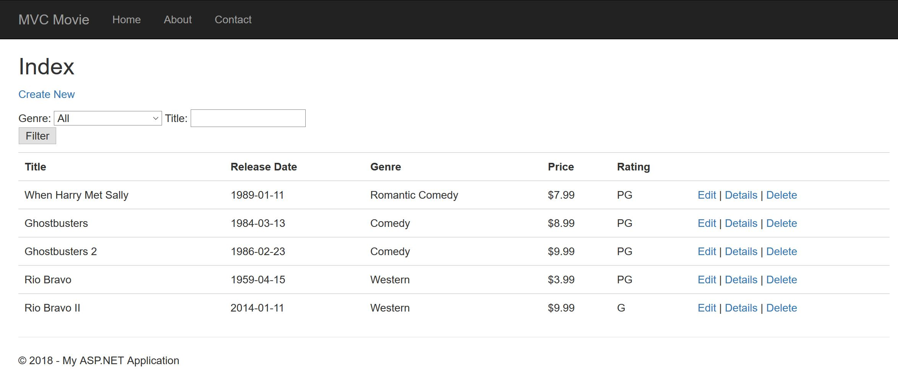
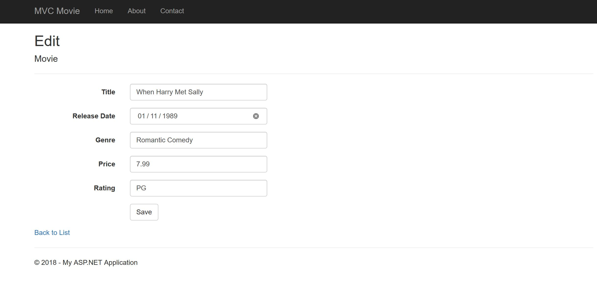
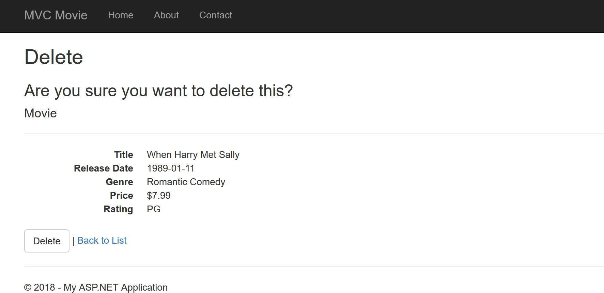

# Lab41-MVC5
CODE: ASP.NET 4.6 for Code Fellows C#/ASP.NET course

**Author**: Earl Jay Caoile  
**Version**: 1.0.0

## Overview
This web application shows another way to implement lab 12 MVC Movie App 
using .NET Framework instead of .NET Core. 

## Getting Started
The following is required to run the program.
1. Visual Studio 2017 
2. The .NET desktop development workload enabled
3. .NET Framework NuGet Packages

## Example

## Happy path
- play app in Visual Studio
- click MVC Movie on top left of nav bar
- look at list of movies and perform 
- CRUD operations (create, read, update, delete)
- smile and close the app

## Architecture
This application is created using ASP.NET Framework 4.6  
*Languages*: C#, HTML, CSS  
*Type of Applicaiton*: Web Application  

## Change Log
07-31-2018 2:00 PM - initial scaffolding  
07-31-2018 6:45 PM - finished tutorial  
07-31-2018 9:45 PM - finished readme  
